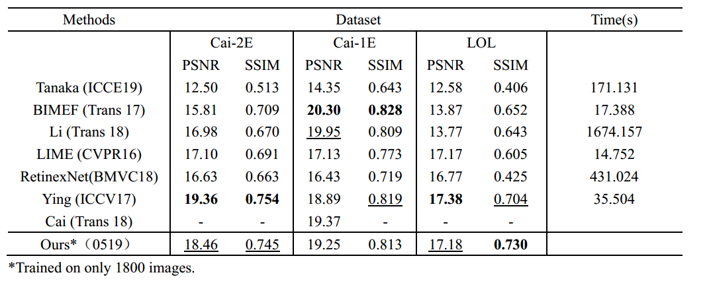
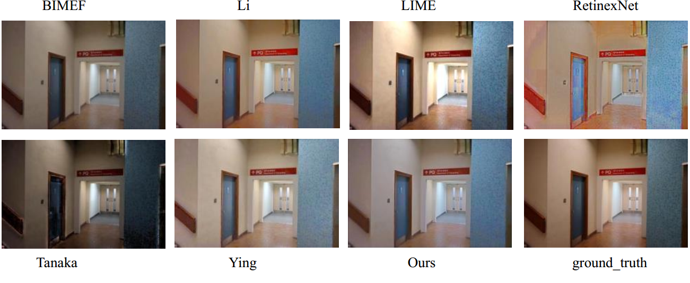

# Deep-Cascade-Residual-CNN-for-Low-light-Image-Ehancement
In this project, we explored a new deep cascade residual CNN which is designed for low-level Image-Enhancement tasks. It is now tested in the low-light Image ehancement task. The framework is composed of several detachable Sub-U_nets, where both the high-level and low-level features are taken as its input to jointly enhance the details and global styles in an image. A global-regional detail module is further introduced to facilitate the learning of detailed features. In the small-scale experiment(30th, April), we found that this network had already achieved a competitive results. Moreover, our network has relatively fewer paremeters compared with many methods proposed in 2018 and 2019. We suppose this network structure could also be used in other low-level image enhancement tasks.

Since we are still working on this project, we would not release our source code and metwork framework till better results yield and publication in the future. More experiments are now undergoing.  
     
However, some of the enhanced low-light imagses are shown here.   
     
Note that because of the RAM limitation of this machine (8G), the ‘5.bmp’ could not be processed, and that's why we give the results of the remaining 9 images.  
     
Still, this result is yield in a small-scale test. As we see that some artifacts do exist in some testing samples, such as the ‘9.bmp’ and '10.bmp'. This is mainly caused by insuffucient trainning and limited dataset (GTX 1060, 25 hours with only 1800+ training images). We will perfect this model in around 2 months.  
           
The test images used here is cited from LIME (https://sites.google.com/view/xjguo/lime).

SEE THE RESULTS BELOW.  
* Quantitive evaluation  

       
* Visual evaluation 

           

If you can not preview these images , please feel free to download the files above.
