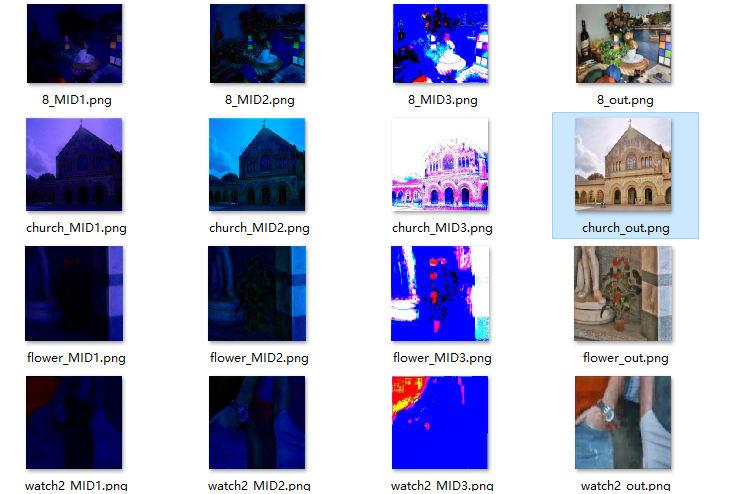
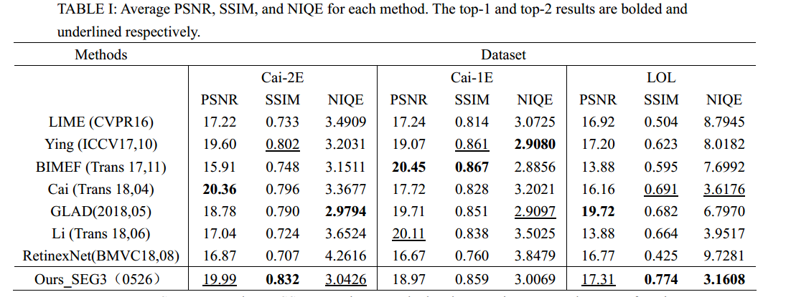
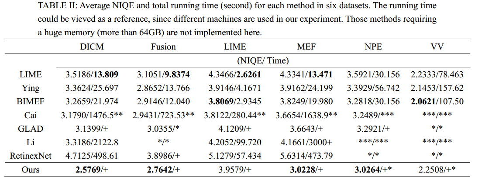
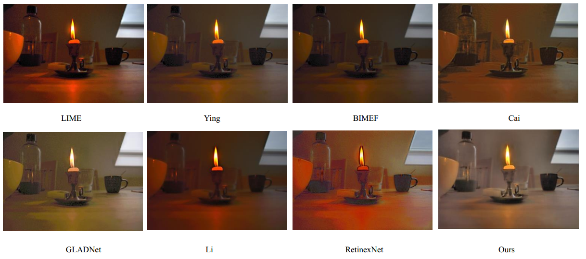
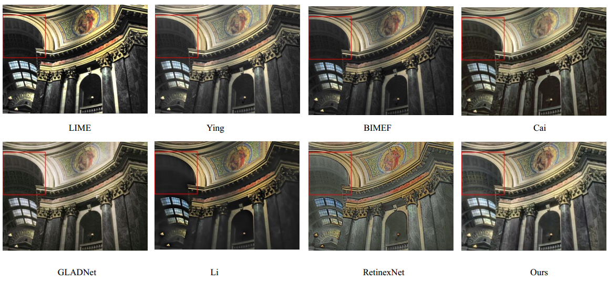
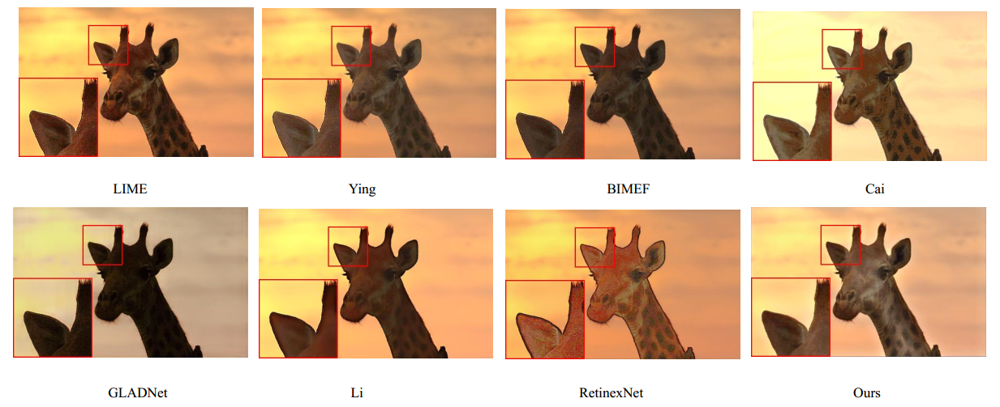
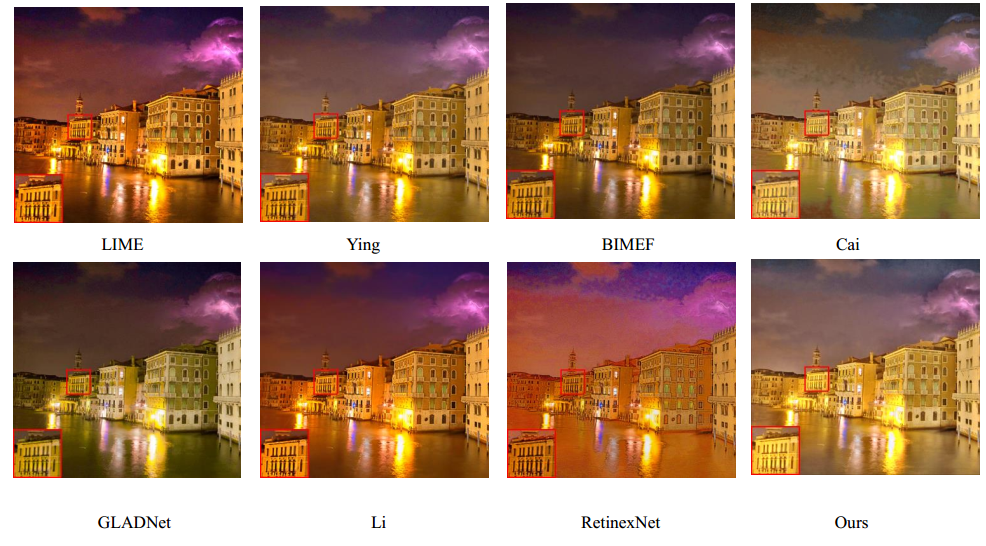
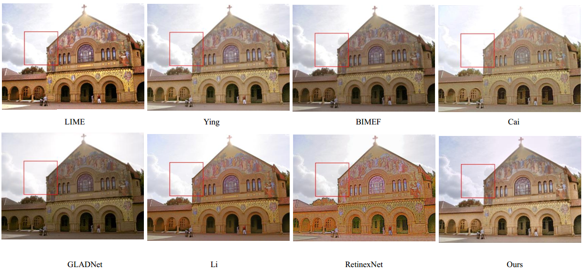
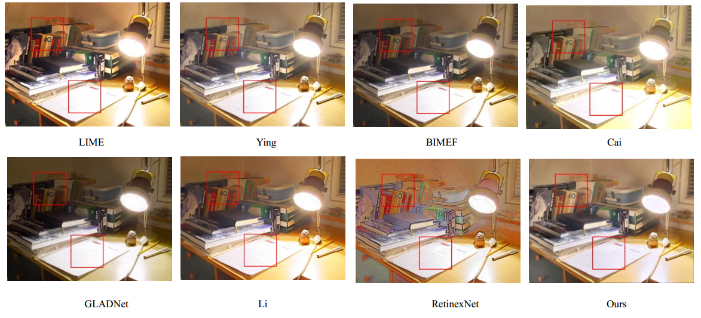

# Deep-Cascade-Residual-CNN-for-Low-light-Image-Ehancement
                                          Kun Lu   Shanxi University  
       
*                                                Abstract  
    In this project, we explored a new deep cascade residual CNN which is designed for low-level Image-Enhancement tasks. It is now tested in the low-light Image ehancement task. The framework is composed of several detachable Sub-U_nets, where both the high-level and low-level features are taken as its input to jointly enhance the details and global styles in an image. A global-regional detail module is further introduced to facilitate the learning of detailed features. In the small-scale experiment(30th, April), we found that this network had already achieved a competitive results. Moreover, our network has relatively fewer paremeters compared with many methods proposed in 2018 and 2019. We suppose this network structure could also be used in other low-level image enhancement tasks.

Since we are still working on this project, we would not release our source code and network framework till better results yield and publication in the future. More experiments are now undergoing.  
     
       
The results of our cascade model is shown below.           
  

# Evaluation  
The test images used here are cited from LIME,Cai,BIMEF,DICM,VV,MEF,NPE,LOL...  
(https://github.com/baidut/BIMEF  https://daooshee.github.io/BMVC2018website/ https://github.com/csjcai/SICE).  
     
     

> Updated on 2019/06/03  
     
## Quantitive evaluation   
(In addition to teh most commonlly used PSNR and SSIM, we also use NIQE to evaluate our method, referring to to authors in GLADNet)  

       
## Visual evaluation  

       
  
  
  
  
  
  

Our enhanced images are provided. If you can not preview these images , please feel free to download the raw images above.

